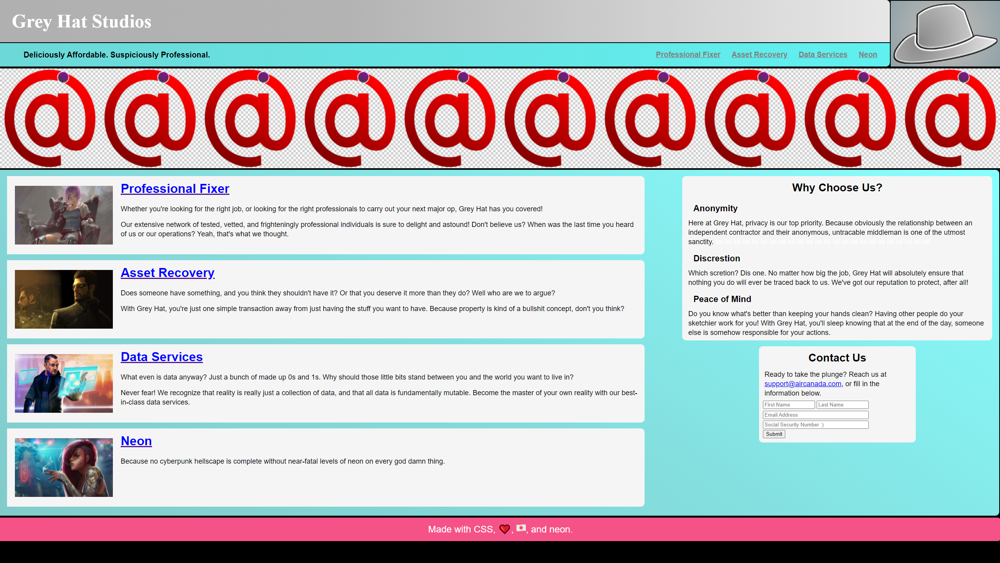
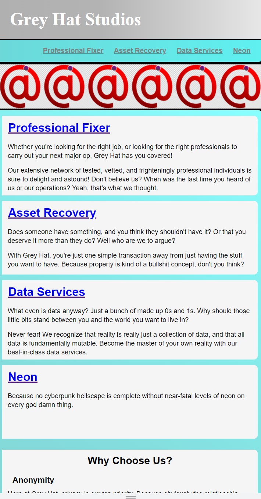
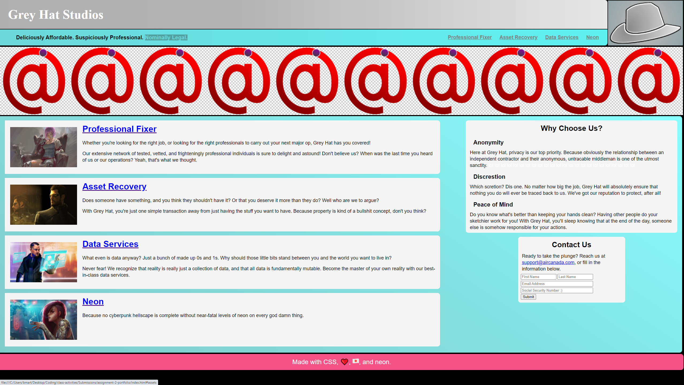

# assignment-2-portfolio

Portfolio project
<!-- Add links from Github -->

Welcome to my portfolio page project! Here you'll find a placeholder page that's ready to go. All the architecture is built in and can receive assets once I have them.

Here's an overview of the page.

• All necessary components: Header, nav bar, main content, aside, footer; images; responsive design; pseudo-classes for dynamic viewing. 

• The page isn't built with flex, but has responsive design to accommodate a wide range of screen sizes.  

• Since I don't have any relevant content to put on the page, images and text are placeholders that can be replaced with minimal effort.

• Hyperlinks are embedded, but they don't point to anywhere yet since there aren't relevant pages (and those are outside the project scope). 

• The nav bar links instead point to the corresponding anchors on /index.

The one thing I'd like to add as I have more stuff is make projects display in one row horizontally and size them waaaay up.

That should take care of everything for now. Thanks for reading!
